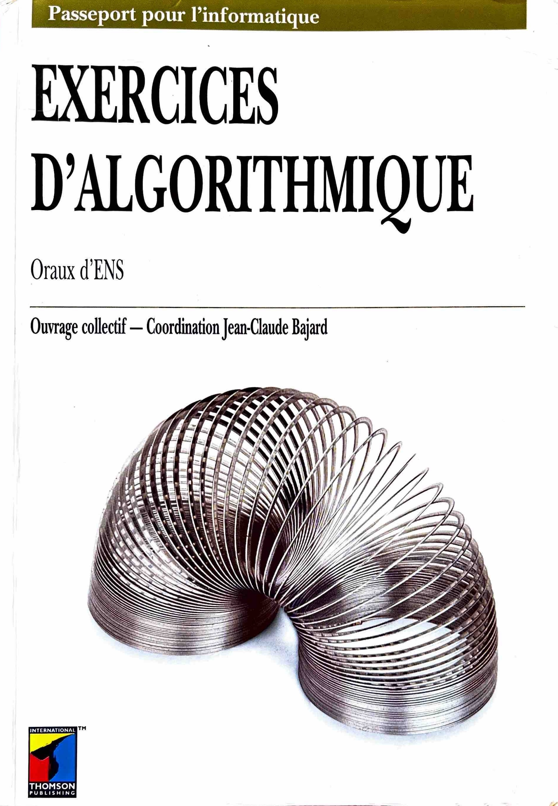

# Exercices d'algorithmique

Réécriture du livre "Exercices d'Algorithmique (Oraux d'ENS)" de Jean-Claude Bajard et al. (1997) avec les corrections rédigées en OCaml.

Si cette retranscription se veut la plus fidèle possible à l'original, certains énoncés ont été légèrement altérés pour utiliser des notations plus récentes et correspondant à la syntaxe du langage OCaml.

Il est à noter que certaines approches proposées dans les corrigés suivent un style impératif bien qu'il soit tout à fait possible et parfois peut-être plus habile d'adopter une approche fonctionnelle. En outre, plusieurs fonctionnalités du langage OCaml (listes, pattern-matching, ...) réduisent grandement la difficulté de certaines questions algorithmiques qui se limitaient à l'usage de tableaux de taille fixe.

 

  
   
  <em>Première de couverture</em>

